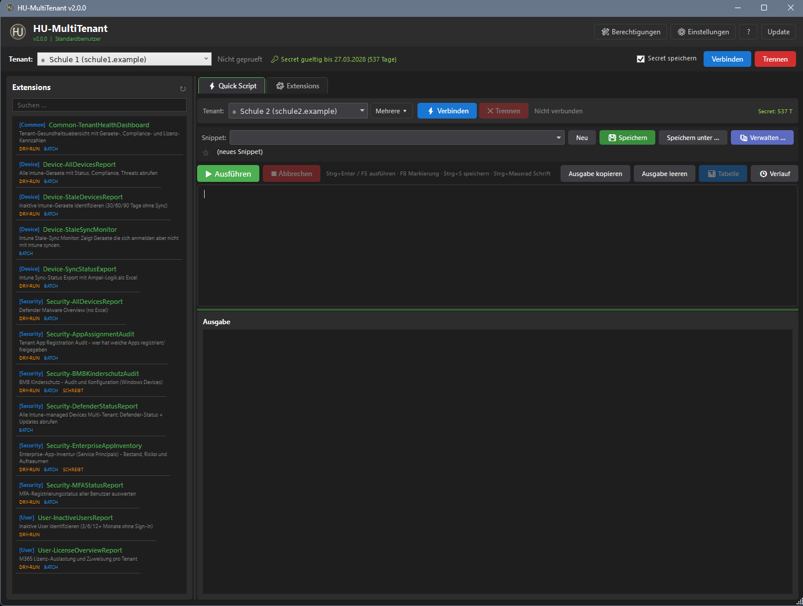
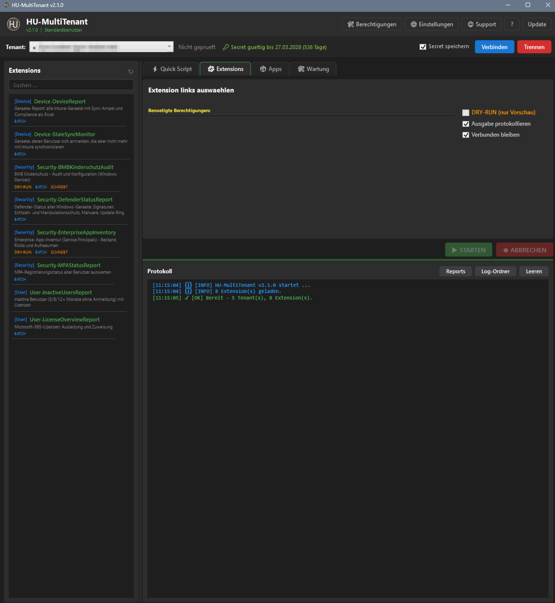
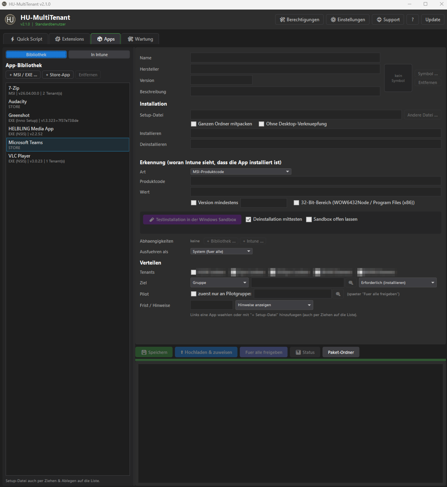
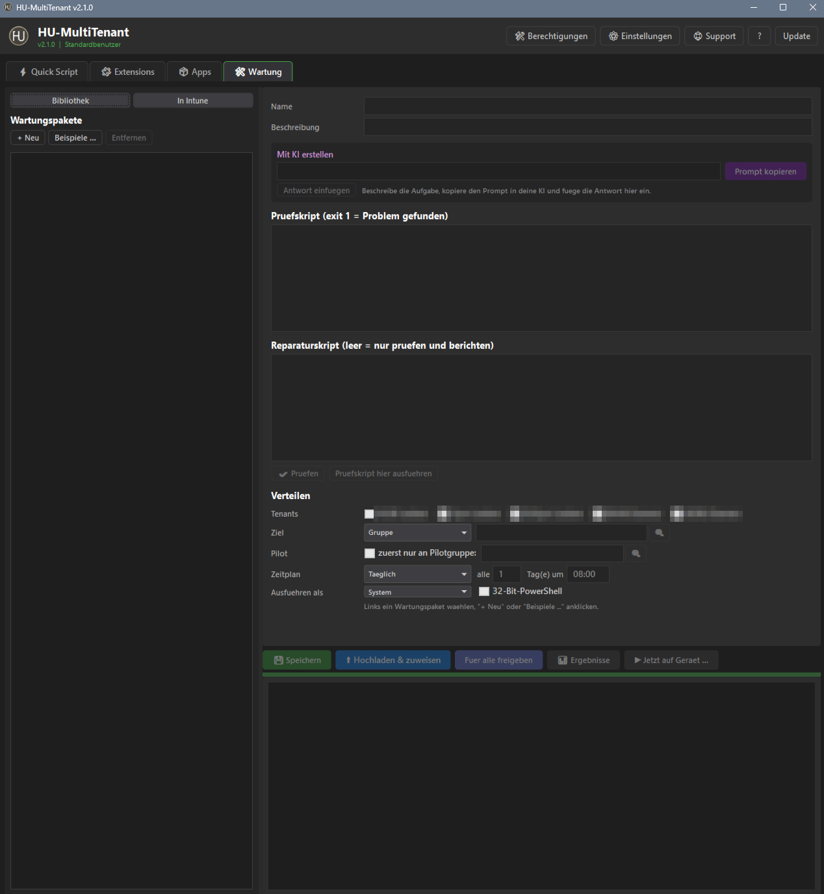

<h1 align="center"> HU-MultiTenant</h1>

<b>Microsoft 365 und Intune für mehrere Tenants – aus einer Oberfläche</b> 
Ad-hoc-PowerShell im Tenant-Kontext mit Snippet-Bibliothek, fertige Reports als Extensions, App-Verteilung mit Update-Erkennung, Wartungsskripte, Tenant-Vergleich und Konfigurations-Backup, Secret-Ablauf im Blick. 
Gebaut für Schulen mit mehreren Standorten – passt für jede Umgebung mit mehreren M365-Tenants.

  
  
  
  
  
  

  <a href="https://chiliapple.github.io/HU-MultiTenant/Docs/Anleitung.html"><b>Anleitung</b></a> ·
  <a href="INSTALL.md">Installation</a> ·
  <a href="SNIPPET-DEVELOPMENT.md">Snippets schreiben</a> ·
  <a href="EXTENSION-DEVELOPMENT.md">Extensions entwickeln</a> ·
  <a href="CHANGELOG.md">Änderungen</a> ·
  <a href="LICENSE">Lizenz</a>

  
  
  
  
   Quick Script · Extensions · Apps · Wartung – zum Vergrößern anklicken

---

| | |
|---|---|
| **Quick Script** | PowerShell direkt im Tenant – Token und Graph-Funktionen sind schon da. Auf mehreren Tenants nacheinander, Eingabefelder per `# @param`, Ergebnis als Tabelle mit CSV-/Excel-Export, Verlauf je Lauf |
| **Snippets** | eigene Skript-Bibliothek mit Beschreibung, Kategorien, Favoriten, Suche (auch im Code), Import/Export; 12 Beispiele dabei |
| **Extensions** | fertige Reports und Aktionen mit Parametern, Dry-Run und Excel-Report (Liste unten) |
| **Apps** | MSI, EXE und Store-Apps an mehrere Tenants verteilen: Setup hineinziehen, Testinstallation in der Windows Sandbox ermittelt Erkennung und Deinstallation, Abhängigkeiten, Status je Gerät; vorhandene Intune-Apps tenantübergreifend verwalten; neue Versionen über winget erkennen und holen |
| **Wartung** | Intune Remediations mit KI erstellen, automatisch prüfen, in der Windows Sandbox wie Intune (als SYSTEM) testen, Werte als Eingabefelder, mit Zeitplan verteilen, Ergebnisse je Gerät; vorhandene Skripte verwalten und in andere Tenants kopieren |
| **Analyse** | Was bekommt eine Gruppe, ein Gerät oder ein Benutzer? Alle Apps, Profile, Richtlinien und Skripte über alle Tenants – inkl. verschachtelter Gruppen und Ausschlüsse; Tenant-Vergleich mit Kopieren fehlender Richtlinien; Backup mit Verlauf (wer hat was geändert) und Wiederherstellen |
| **Secrets** | DPAPI-verschlüsselt, Ablaufdatum je Tenant, Warnung vor Ablauf |
| **Update** | Kanal Stabil/Test, jede Datei per SHA-256 geprüft, nur signierte Releases |

## Schnellstart

1. Je Tenant eine **App-Registrierung** anlegen – [INSTALL.md](INSTALL.md)
2. `Pull.ps1` in einen leeren Ordner legen und ausführen: `powershell -ExecutionPolicy Bypass -File Pull.ps1`
3. **Start-HUMultiTenant.cmd** → **Einstellungen › Tenants › + Neu** → IDs und Secret eintragen → **Speichern**

Alles Weitere steht in der **[Anleitung](https://chiliapple.github.io/HU-MultiTenant/Docs/Anleitung.html)** – im Programm mit **F1**.

## Extensions

| Bereich | Extension | Inhalt |
|---|---|---|
| Device | Device-DeviceReport | alle Intune-Geräte: Sync-Ampel (OK / Warnung / Kritisch / Cleanup-Gefahr), nicht konforme Geräte mit Richtlinien |
| Device | Device-StaleSyncMonitor | Benutzer meldet sich an, Gerät synchronisiert aber nicht mehr mit Intune |
| Security | Security-DefenderStatusReport | Defender-Status aller Windows-Geräte: Signaturen, Echtzeitschutz, Manipulationsschutz, Malware, Update-Ring |
| Security | Security-EnterpriseAppInventory | Inventur der Enterprise-Apps (Herkunft, Berechtigungen, Inaktive, Duplikate) – optional aufräumen (Dry-Run Standard, Schutzliste) |
| Security | Security-MFAStatusReport | MFA-Registrierung aller Benutzer |
| User | User-InactiveUsersReport | inaktive Benutzer 3/6/12+ Monate mit Lizenzen |
| User | User-LicenseOverviewReport | Lizenz-Auslastung |

Eigene Snippets: [SNIPPET-DEVELOPMENT.md](SNIPPET-DEVELOPMENT.md) · eigene Extensions: [EXTENSION-DEVELOPMENT.md](EXTENSION-DEVELOPMENT.md)

## Sicherheit

- Secrets nur DPAPI-verschlüsselt im Benutzerprofil, Tokens nur im Speicher, nie im Protokoll
- `settings.json` enthält nur Tenant- und Anwendungs-IDs; Einstellungen, Snippets und Protokolle sind nicht im Repository
- optionale Sperre nach Leerlauf, entsperren mit Windows Hello oder PIN – zusätzlicher Schutz, weil ein offenes Programm Zugriff auf mehrere Tenants hat
- Not-Aus: alle lokal gespeicherten Secrets nach Rückfrage löschen und die App-Registrierungen zum Widerrufen öffnen
- Updates werden nur installiert, wenn Prüfsummen und Signatur stimmen
- automatische Tests bei jedem Push (Windows PowerShell 5.1)

---

**Lizenz:** kostenlose Nutzung erlaubt, Veränderung und Weitergabe veränderter Fassungen nicht – Details in [LICENSE](LICENSE) (deutsch und englisch).
*License: free to use, modification and redistribution of modified versions not permitted – see [LICENSE](LICENSE) (German and English).*
